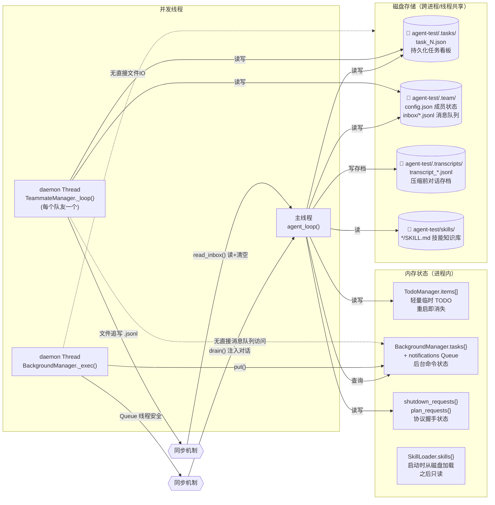

```mermaid
flowchart LR
    subgraph STORAGE["磁盘存储（跨进程/线程共享）"]
        direction TB
        F1[("📁 agent-test/.tasks/\ntask_N.json\n持久化任务看板")]
        F2[("📁 agent-test/.team/\nconfig.json  成员状态\ninbox/*.jsonl  消息队列")]
        F3[("📁 agent-test/.transcripts/\ntranscript_*.jsonl\n压缩前对话存档")]
        F4[("📁 agent-test/skills/\n*/SKILL.md  技能知识库")]
    end

    subgraph MEMORY["内存状态（进程内）"]
        direction TB
        M1["TodoManager.items[]\n轻量临时 TODO\n重启即消失"]
        M2["BackgroundManager.tasks{}\n+ notifications Queue\n后台命令状态"]
        M3["shutdown_requests{}\nplan_requests{}\n协议握手状态"]
        M4["SkillLoader.skills{}\n启动时从磁盘加载\n之后只读"]
    end

    subgraph THREADS["并发线程"]
        direction TB
        T1["主线程\nagent_loop()"]
        T2["daemon Thread\nBackgroundManager._exec()"]
        T3["daemon Thread\nTeammateManager._loop()\n(每个队友一个)"]
    end

    T1 -->|"读写"| F1
    T1 -->|"读写"| F2
    T1 -->|"写存档"| F3
    T1 -->|"读"| F4
    T1 -->|"读写"| M1
    T1 -->|"查询"| M2
    T1 -->|"读写"| M3

    T2 -->|"put()"| M2
    T2 -.->|"无直接文件IO"| STORAGE

    T3 -->|"读写"| F1
    T3 -->|"读写"| F2
    T3 -.->|"无直接消息队列访问"| M2

    SYNC1{{"同步机制"}}
    T2 -->|"Queue 线程安全"| SYNC1
    SYNC1 -->|"drain() 注入对话"| T1

    SYNC2{{"同步机制"}}
    T3 -->|"文件追写 .jsonl"| SYNC2
    SYNC2 -->|"read_inbox() 读+清空"| T1

```
