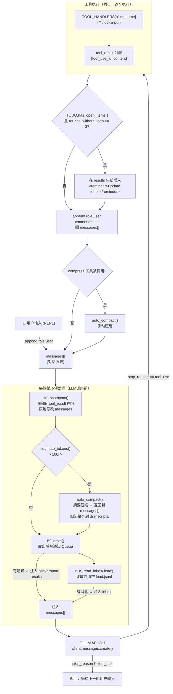

```mermaid
flowchart TD
    USER["👤 用户输入 (REPL)"] -->|"append role:user"| MSG["messages[]<br/>(对话历史)"]

    MSG --> PRE["每轮循环预处理"]

    subgraph PRE["每轮循环预处理（LLM调用前）"]
        direction TB
        MC["microcompact()<br/>清除旧 tool_result 内容<br/>原地修改 messages"]
        AC{"estimate_tokens()<br/>> 100k?"}
        COMPACT["auto_compact()<br/>摘要压缩 → 返回新 messages[]<br/>旧记录存到 .transcripts/"]
        DRAIN["BG.drain()<br/>取出后台通知 Queue"]
        INBOX["BUS.read_inbox('lead')<br/>读取并清空 lead.jsonl"]
        MC --> AC
        AC -->|"是"| COMPACT
        AC -->|"否"| DRAIN
        COMPACT --> DRAIN
        DRAIN -->|"有通知 → 注入 background-results"| MSG2["注入<br/>messages[]"]
        INBOX -->|"有消息 → 注入 inbox"| MSG2
        DRAIN --> INBOX
    end

    MSG2 --> LLM["🤖 LLM API Call<br/>client.messages.create()"]

    LLM -->|"stop_reason != tool_use"| RETURN["返回，等待下一轮用户输入"]
    LLM -->|"stop_reason == tool_use"| DISPATCH["工具执行循环<br/>遍历 response.content"]

    subgraph DISPATCH["工具执行（同步，逐个执行）"]
        direction TB
        HANDLER["TOOL_HANDLERS[block.name](**block.input)"]
        RESULT["tool_result 列表<br/>{tool_use_id, content}"]
        HANDLER --> RESULT
    end

    DISPATCH --> NAG{"TODO.has_open_items()<br/>且 rounds_without_todo >= 3?"}
    NAG -->|"是"| REMINDER["在 results 头部插入<br/>&lt;reminder&gt;Update todos&lt;/reminder&gt;"]
    NAG -->|"否"| APPEND
    REMINDER --> APPEND["append role:user content:results<br/>回 messages[]"]
    APPEND --> MAN{"compress 工具被调用?"}
    MAN -->|"是"| COMPACT2["auto_compact()<br/>手动压缩"]
    MAN -->|"否"| MSG
    COMPACT2 --> MSG

```
