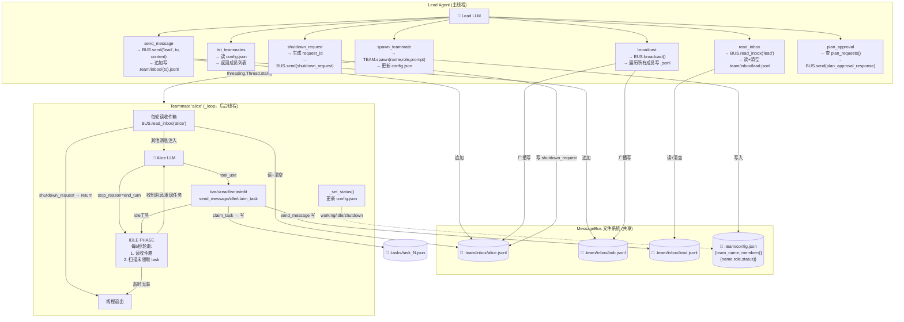

```mermaid
flowchart TD
    subgraph LEAD["Lead Agent (主线程)"]
        direction LR
        LLM_L["🤖 Lead LLM"]
        SPAWN["spawn_teammate\n→ TEAM.spawn(name,role,prompt)\n→ 更新 config.json"]
        LIST_TM["list_teammates\n→ 读 config.json\n→ 返回成员列表"]
        SEND["send_message\n→ BUS.send('lead', to, content)\n→ 追加写 .team/inbox/{to}.jsonl"]
        BCAST["broadcast\n→ BUS.broadcast()\n→ 遍历所有成员写 .jsonl"]
        RD_INB["read_inbox\n→ BUS.read_inbox('lead')\n→ 读+清空 .team/inbox/lead.jsonl"]
        SHUT["shutdown_request\n→ 生成 request_id\n→ BUS.send(shutdown_request)"]
        PLAN["plan_approval\n→ 查 plan_requests{}\n→ BUS.send(plan_approval_response)"]

        LLM_L --> SPAWN & LIST_TM & SEND & BCAST & RD_INB & SHUT & PLAN
    end

    subgraph BUS_FS["MessageBus 文件系统 (共享)"]
        direction TB
        JSONL_A[("📄 .team/inbox/alice.jsonl")]
        JSONL_B[("📄 .team/inbox/bob.jsonl")]
        JSONL_L[("📄 .team/inbox/lead.jsonl")]
        CFG[("📄 .team/config.json\n{team_name, members[]\n  {name,role,status}}")]
    end

    subgraph ALICE["Teammate 'alice' (_loop，后台线程)"]
        direction TB
        CHKINBOX_A["每轮读收件箱\nBUS.read_inbox('alice')"]
        LLM_A["🤖 Alice LLM"]
        TOOLS_A["bash/read/write/edit\nsend_message/idle/claim_task"]
        IDLE_A["IDLE PHASE\n每5秒轮询:\n1. 读收件箱\n2. 扫描未领取 task"]
        STATUS_A["_set_status()\n更新 config.json"]

        CHKINBOX_A -->|"shutdown_request → return"| EXIT_A["线程退出"]
        CHKINBOX_A -->|"其他消息注入"| LLM_A
        LLM_A -->|"tool_use"| TOOLS_A
        LLM_A -->|"stop_reason=end_turn"| IDLE_A
        TOOLS_A -->|"idle工具"| IDLE_A
        IDLE_A -->|"超时无事"| EXIT_A
        IDLE_A -->|"收到消息/发现任务"| LLM_A
        STATUS_A -.->|"working/idle/shutdown"| CFG
    end

    SPAWN -->|"threading.Thread.start()"| ALICE
    SPAWN -->|"写入"| CFG
    SEND -->|"追加"| JSONL_A
    SEND -->|"追加"| JSONL_B
    BCAST -->|"广播写"| JSONL_A & JSONL_B
    RD_INB -->|"读+清空"| JSONL_L

    CHKINBOX_A -->|"读+清空"| JSONL_A
    TOOLS_A -->|"send_message 写"| JSONL_L
    TOOLS_A -->|"claim_task → 写"| TASK_J[("📁 .tasks/task_N.json")]

    SHUT -->|"写 shutdown_request"| JSONL_A

```
