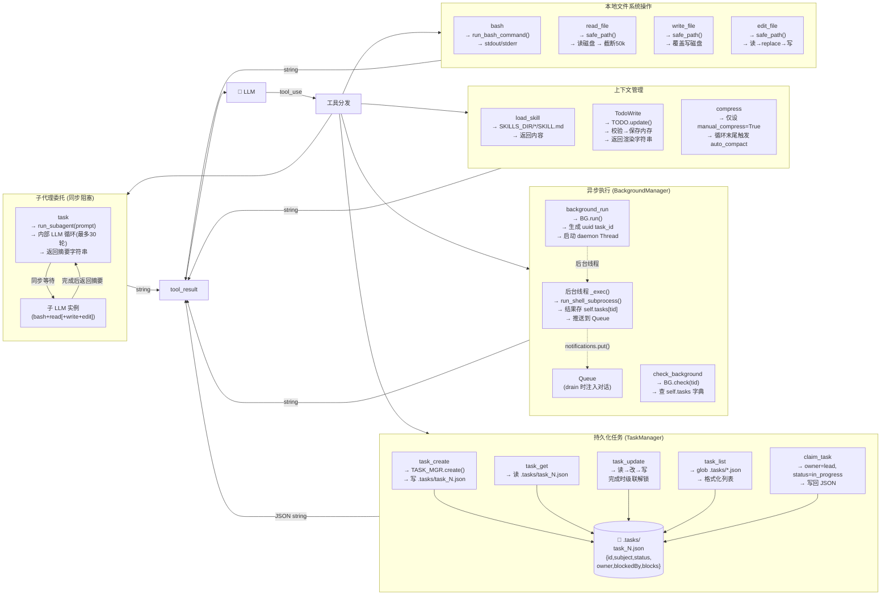

```mermaid
flowchart LR
    LLM["🤖 LLM"] -->|"tool_use"| DISPATCH["工具分发"]

    subgraph LOCAL["本地文件系统操作"]
        direction TB
        BASH["bash\n→ run_bash_command()\n→ stdout/stderr"]
        READ["read_file\n→ safe_path()\n→ 读磁盘 → 截断50k"]
        WRITE["write_file\n→ safe_path()\n→ 覆盖写磁盘"]
        EDIT["edit_file\n→ safe_path()\n→ 读→replace→写"]
    end

    subgraph CONTEXT["上下文管理"]
        direction TB
        SKILL["load_skill\n→ SKILLS_DIR/*/SKILL.md\n→ 返回<skill>内容"]
        TODO_W["TodoWrite\n→ TODO.update()\n→ 校验→保存内存\n→ 返回渲染字符串"]
        COMPRESS["compress\n→ 仅设 manual_compress=True\n→ 循环末尾触发 auto_compact"]
    end

    subgraph ASYNC["异步执行 (BackgroundManager)"]
        direction TB
        BG_RUN["background_run\n→ BG.run()\n→ 生成 uuid task_id\n→ 启动 daemon Thread"]
        BG_CHECK["check_background\n→ BG.check(tid)\n→ 查 self.tasks 字典"]
        BG_THREAD["后台线程 _exec()\n→ run_shell_subprocess()\n→ 结果存 self.tasks[tid]\n→ 推送到 Queue"]
        BG_RUN -.->|"后台线程"| BG_THREAD
        BG_THREAD -.->|"notifications.put()"| QUEUE["Queue\n(drain 时注入对话)"]
    end

    subgraph PERSISTENT["持久化任务 (TaskManager)"]
        direction TB
        T_CREATE["task_create\n→ TASK_MGR.create()\n→ 写 .tasks/task_N.json"]
        T_GET["task_get\n→ 读 .tasks/task_N.json"]
        T_UPD["task_update\n→ 读→改→写\n完成时级联解锁"]
        T_LIST["task_list\n→ glob .tasks/*.json\n→ 格式化列表"]
        T_CLAIM["claim_task\n→ owner=lead, status=in_progress\n→ 写回 JSON"]
        TASK_FILES[("📁 .tasks/\ntask_N.json\n{id,subject,status,\nowner,blockedBy,blocks}")]
        T_CREATE --> TASK_FILES
        T_GET --> TASK_FILES
        T_UPD --> TASK_FILES
        T_LIST --> TASK_FILES
        T_CLAIM --> TASK_FILES
    end

    subgraph DELEGATION["子代理委托 (同步阻塞)"]
        direction TB
        TASK_TOOL["task\n→ run_subagent(prompt)\n→ 内部 LLM 循环(最多30轮)\n→ 返回摘要字符串"]
        SUB_LLM["子 LLM 实例\n(bash+read[+write+edit])"]
        TASK_TOOL -->|"同步等待"| SUB_LLM
        SUB_LLM -->|"完成后返回摘要"| TASK_TOOL
    end

    DISPATCH --> LOCAL
    DISPATCH --> CONTEXT
    DISPATCH --> ASYNC
    DISPATCH --> PERSISTENT
    DISPATCH --> DELEGATION

    LOCAL -->|"string"| RES["tool_result"]
    CONTEXT -->|"string"| RES
    ASYNC -->|"string"| RES
    PERSISTENT -->|"JSON string"| RES
    DELEGATION -->|"string"| RES
    RES --> LLM

```
